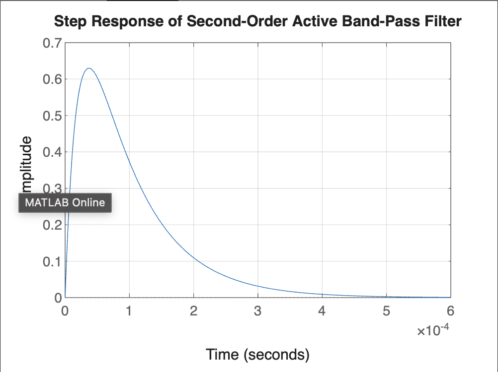

# Active Band Pass Filter 2Khz-8Khz

## MATLAB Test:-

```bash
clc;
clear;
close all;

% High-Pass Section (2 kHz)
R1 = 800;   % 800Ω 
R4 = 800;   % 800Ω 
C2 = 0.1e-6; % 0.1µF 

% Low-Pass Section (8 kHz)
R5 = 200;   % 200Ω 
C3 = 0.1e-6; % 0.1µF 

% Compute Cutoff Frequencies
fc_high = 1 / (2 * pi * R1 * C2); 
fc_low = 1 / (2 * pi * R5 * C3); 

fprintf('High-Pass Cutoff: %.2f Hz\n', fc_high);
fprintf('Low-Pass Cutoff: %.2f Hz\n', fc_low);

% Transfer Functions
s = tf('s');

% High-Pass Filter Transfer Function
HPF = (R1 * C2 * s) / (R1 * C2 * s + 1);

% Low-Pass Filter Transfer Function
LPF = 1 / (R5 * C3 * s + 1);

% Combined Band-Pass Filter
BPF = HPF * LPF;

% Bode Plot
figure;
bode(BPF);
grid on;
title('Bode Plot of Second-Order Active Band-Pass Filter');

% Frequency Response (Magnitude Plot)
figure;
freqs([1, 0], [R1 * C2, 1]); % High-Pass
hold on;
freqs([1], [R5 * C3, 1]); % Low-Pass
grid on;
title('Frequency Response of Second-Order Active Band-Pass Filter');
legend('High-Pass', 'Low-Pass');

% Step Response
figure;
step(BPF);
grid on;
title('Step Response of Second-Order Active Band-Pass Filter');
```
<br>
<br>
<br>


<br>
<br>
<br>


<br>
<br>
<br>


<br>
<br>
<br>


<br>
<br>
<br>

