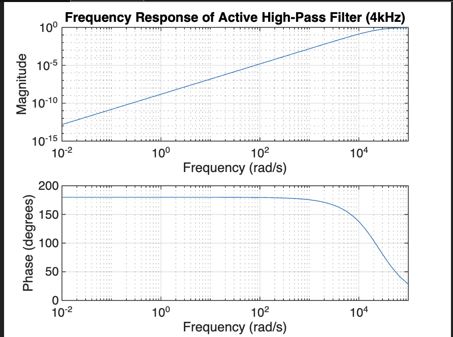

# Active High Pass Filter 4Khz

## MATLAB Test:-

```bash
clc; 
clear; 
close all;


R1 = 390;   % 390Ω
R2 = 390;   % 390Ω
R3 = 10e3;  % 10kΩ (For Op-Amp feedback)
R4 = 10e3;  % 10kΩ (For Op-Amp feedback)
C1 = 0.1e-6; % 0.1µF (100nF)
C2 = 0.1e-6; % 0.1µF (100nF)

%  Cutoff Frequency (f_c)
fc = 1 / (2 * pi * sqrt(R1 * R2 * C1 * C2));
fprintf('Cutoff Frequency: %.2f Hz\n', fc);

%  (Laplace Domain)
s = tf('s');
H = (R1 * R2 * C1 * C2 * s^2) / (R1 * R2 * C1 * C2 * s^2 + (R1 + R2) * C1 * s + 1);

% Plot Bode Plot (Magnitude & Phase Response)
figure;
bode(H);
grid on;
title('Bode Plot of Active High-Pass Filter (4kHz)');

%  (Magnitude Plot)
figure;
freqs([R1 * R2 * C1 * C2, 0, 0], [R1 * R2 * C1 * C2, (R1 + R2) * C1, 1]);
grid on;
title('Frequency Response of Active High-Pass Filter (4kHz)');

% Step Response
figure;
step(H);
grid on;
title('Step Response of Active High-Pass Filter (4kHz)');
```
<br>
<br>
<br>


<br>
<br>
<br>


<br>
<br>
<br>


<br>
<br>
<br>



<br>
<br>
<br>

