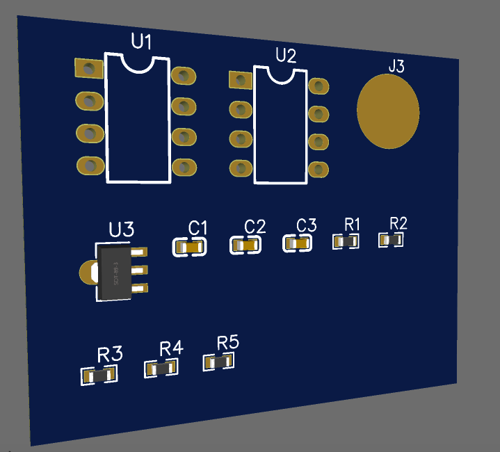

# Active Notch Filter 1Khz

## MATLAB Test:-

```bash

fN = 1000;          
BW = 100;            
C = 0.1e-6;          

% Angular frequency
wN = 2 * pi * fN;

% Calculate R using fN = 1 / (2*pi*R*C)
R = 1 / (2 * pi * fN * C);

% Bandwidth relation: BW = 1 / (2*pi*R2*C)
R2 = 1 / (2 * pi * BW * C);

% Frequency vector for analysis
f = logspace(log10(100), log10(10e3), 1000);
w = 2 * pi * f;

% Transfer function of the notch filter
Q = fN / BW;
s = 1j * w;
Hs = (s.^2 + wN^2) ./ (s.^2 + (wN / Q) * s + wN^2);

% Plot the magnitude response
figure;
semilogx(f, 20*log10(abs(Hs)), 'LineWidth', 2);
grid on;
xlabel('Frequency (Hz)');
ylabel('Magnitude (dB)');
title('Notch Filter Frequency Response');
xline(fN, '--r', 'f_N = 1kHz');
ylim([-60 5]);

% Calculate notch depth and frequency
[notch_mag, idx] = min(abs(Hs));     
notch_freq = f(idx);                 
notch_depth_dB = 20 * log10(notch_mag);

% Display results
fprintf('R = %.2f ohms\n', R);
fprintf('R2 (for bandwidth) = %.2f ohms\n', R2);
fprintf('Notch Frequency = %.2f Hz\n', notch_freq);
fprintf('Notch Depth ≈ %.2f dB\n', notch_depth_dB);

```
<br>
<br>
<br>

## Matlab Code Output


<br>
<br>
<br>


## Schemtaics Design of Notch Filter:-


## Working in Above 1 khz (Falstad Simultation):-


## Working in Less 1 khz (Falstad Simultation):-


## Working in 1Khz (Falstad Simultation):-


## Only PCB Design:-


## PCB Design 2D:-


## PCB Design 3D:-



## Falstad Simultation Link:-

```bash
https://tinyurl.com/29tznblg
```